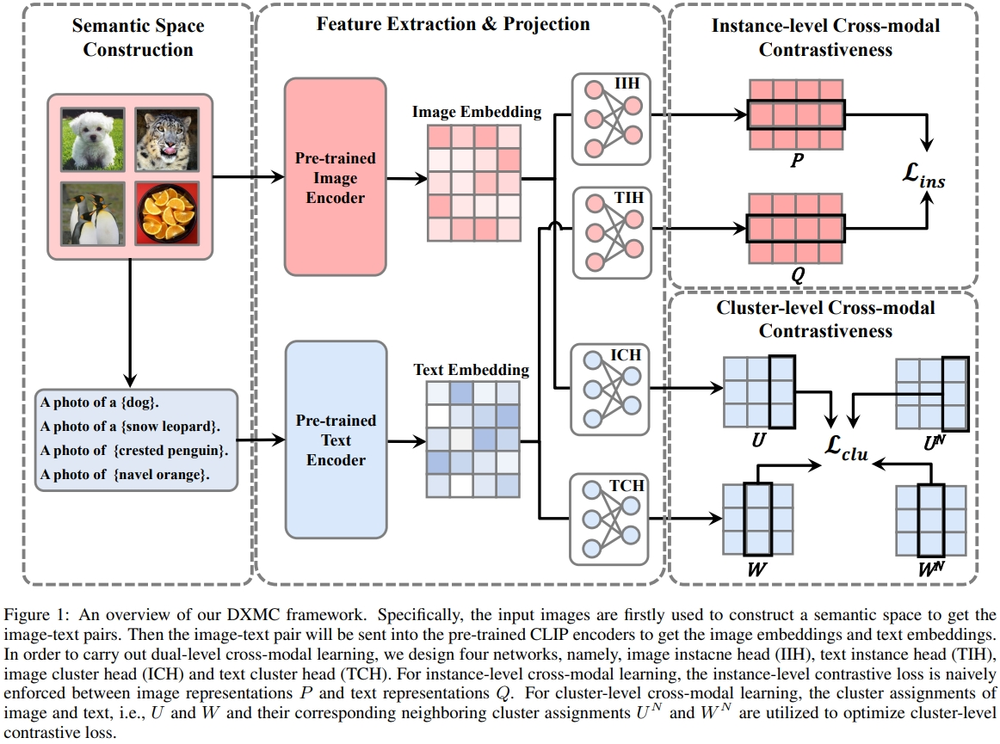
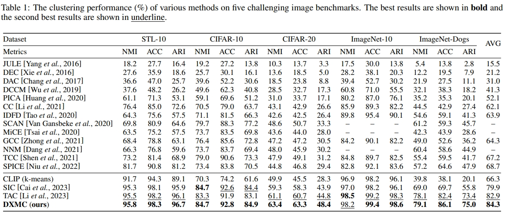

# Dual-level Cross-modal Contrastive Clustering (DXMC)

This is the offical implementation of the paper entitled “Dual-level Cross-modal Contrastive Clustering” . 

# Proposed Framework

<div align=center></div>

# Main Results

<div align=center></div>

# Dependency

- pytorch>=2.0.1
- torchvision>=0.15.2
- munkres>=1.1.4
- scikit-learn>=1.2.2
- clip>=1.0
- timm>=0.9.2
- faiss-gpu>=1.7.4

# Usage

Our method is built upon  [TAC](https://github.com/XLearning-SCU/2024-ICML-TAC) .  Similarly, we have divided the various steps of our DXMC method into separate `.py` files.. The following is a step-by-step tutorial. Please note that the intermediate results will be saved to the  `./data` folder.

## Image and Text Embedding Inference
To begin, we will compute the image embeddings using the CLIP model by executing:

> python image_embedding.py

Next, we will generate the embeddings of WordNet nouns (located in the `./data` folder) for constructing the text space by executing:

> python text_embedding.py

## Semantic Space Construction
In this part, our objective is to identify discriminative nouns that describe the semantic centers of images. Inspired by the zero-shot classification approach of CLIP, we classify all nouns into $k$ image semantic centers in reverse and choose the most confident nouns for each image semantic center by executing:

> python filter_nouns.py

The chosen nouns form the text space tailored to the input images. Subsequently, we extract nouns for each image to calculate its corresponding representation in the text modality by running:

> python retrieve_text.py

## Training-free Clustering
Upon completing the Semantic Space Construction phase, we establish an exceptionally straightforward baseline by employing $k$-means on the combined image and text features. This can be achieved by executing:

> python concat_kmeans.py

It is important to highlight that this approach necessitates no supplementary training or adjustments to CLIP. Nevertheless, it has the potential to notably enhance clustering performance when contrasted with directly employing $k$-means solely on the image embeddings.

## Cluster Heads Training
To enhance consistent learning between image and text representations and ultimately refine clustering performance, we train additional cluster heads by executing:

> python train_head_ours.py

## Visualization
<div align=center></div>

If you want to see some TSNE figures, you can firstly save the checkpoint by yourself and then execute:

> python eval_head.py
# Dataset

CIFAR-10, CIFAR-20, STL-10 will be automatically downloaded by Pytorch. ImageNet-10 and ImageNet-dogs are subsets of the ImageNet dataset, with class indices provided [here](https://github.com/Yunfan-Li/Contrastive-Clustering/tree/main/datasets). 

# Citation

```
@misc{zhang2024duallevelcrossmodalcontrastiveclustering,
      title={Dual-Level Cross-Modal Contrastive Clustering}, 
      author={Haixin Zhang and Yongjun Li and Dong Huang},
      year={2024},
      eprint={2409.04561},
      archivePrefix={arXiv},
      primaryClass={cs.CV},
      url={https://arxiv.org/abs/2409.04561}, 
}
```
